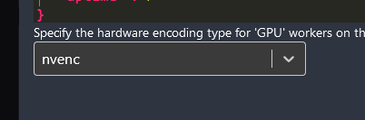

# Custom Tdarr Plugins I made

## Tdarr_Plugin_H264_8bit_AAC

This plugin converts the output file to the following
- 8bit H264 (High profile)
- AAC Audio tracks
- MKV container

It can also use your nvidia GPU to encode if you set the node up correctly.

In the node, make sure you specify that the hardware encoding type for GPU workers is `nvenc`

This will then make sure the command that is run can run on the GPU. If you select `any` in here, then the plugin will issues the `libx264` transcode option which is a CPU task so even if you have a GPU worker, it will run on the CPU.

### Intallation
Download the `Tdarr_Plugin_H264_8bit_AAC.js` file and add it to your server configs plugin folder.
for me its
`<config>/server/Tdarr/Plugins/local`

Just drop the file in there, and you should now have it as an option to add to a libraries transcode rules. May require a restart of tdarr. 
